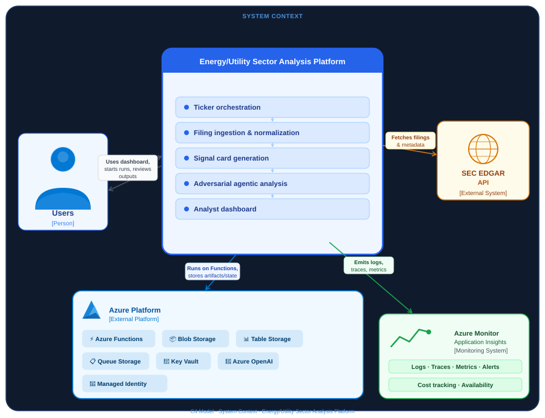

# Cross-Entity SEC 10-K Signal Analysis Engine

> **Multi-agent energy/utilities sector analysis pipeline** — an end-to-end system that analyzes 10-K filings across sector-wide entities for risk sentiment, supply chain tightness, and narrative divergence to inform intelligent decision-making.

---

## Table of Contents

- [Project Summary](#project-summary)
- [Key Findings](#key-findings)
- [Core Features](#core-features)
- [Technical Architecture](#technical-architecture)
- [Technology Stack](#technology-stack)
- [Future Roadmap](#future-roadmap)

---

## Project Summary

The Cross-Entity SEC 10-K Signal Analysis Engine is a production-grade Azure pipeline that processes five years of SEC 10-K filings across 20 energy sector companies — extracting structured analytical signals, detecting cross-entity narrative divergence, and validating findings through adversarial multi-agent debate.

Where traditional financial analysis reads filings in isolation, this system reads the entire sector at once. A 12-field **Signal Card** schema captures risk sentiment, supply chain posture, capacity constraints, and regulatory exposure for each company per filing year. A two-agent **LangGraph architecture** — Analyst vs. Contrarian — then stress-tests each analysis by grounding claims against peer-company evidence, improving factual groundedness from **65% to 85%** across ablation testing.

The system is deployed as a live Streamlit dashboard on Azure Web App, enabling analysts to run cross-entity queries and inspect signal timelines interactively.

---

## Diagram

---

## Key Findings

### Vistra (VST) Backlog Signal — 18 Months Early

The engine flagged a **near-doubling of contracted backlog relative to revenue** at Vistra in pre-2023 filings at a time when market consensus was focused on near-term margin compression. The capacity-constraint signal was visible in the structured Signal Cards well before the market repriced the stock on data center power demand tailwinds — margins recovered approximately 18 months later.

### Energy Sector Power Scarcity — Pre-Surge Detection

Cross-entity analysis of supply-tightness and capacity-constraint fields across companies like Constellation Energy (CEG) and Equinix (EQIX) revealed coordinated supply-side pressure building in 2021–2022 filings — preceding the broader data center power demand surge and the sector re-rating that followed.

### Narrative Divergence as a Timing Signal

When one entity's risk disclosures diverge sharply from its sector peers on the same risk theme, the divergence itself is informative. The engine quantifies this cross-entity narrative divergence systematically, enabling detection of asymmetric information embedded in public filings before it surfaces in price action.

---

## Core Features

### Idempotent Ingestion Pipeline
State-table-driven orchestration with skip-on-complete logic across three phases — download, markdown conversion, and section extraction — backed by **Azure Table Storage**. Re-runs are safe; completed phases are skipped automatically.

### Structured Signal Card Extraction
A 12-field schema purpose-built for energy sector analysis. Each company's full 5-year filing history is processed in a single **GPT-4.1** call with Pydantic-enforced structured outputs. Bulk extraction costs reduced **40%** via the Azure OpenAI Batch API.

### Adversarial Multi-Agent Validation
A two-agent **LangGraph** pipeline where an **Analyst Agent** produces initial claims and a **Contrarian Agent** retrieves peer-company Signal Cards to challenge those claims with cross-entity evidence. Groundedness improved from 65% → 85% across 20 ablation queries.

### Prompt Iteration & Model Selection
Three prompt iterations evaluated head-to-head. GPT-4.1 produced **25% more differentiated risk signals** with accurate prior-year evidence citations compared to GPT-4.1-mini, confirming production model selection.

### Live Streamlit Dashboard
Deployed on **Azure Web App** — Signal Card timeline view, live analysis runner, cross-entity comparison. Secured via Managed Identities, Key Vault secrets, and Azure DevOps CI/CD.

---

## Technology Stack

| Category | Technologies |
|---|---|
| **Cloud Platform** | Azure (OpenAI Service, Blob Storage, Table Storage, Web App, Key Vault, Managed Identities, DevOps CI/CD) |
| **LLM & Agents** | GPT-4.1, Azure OpenAI Batch API, LangGraph |
| **Data Extraction** | `edgartools`, SEC EDGAR API, XBRL |
| **Validation** | Pydantic (structured output enforcement) |
| **Dashboard** | Streamlit |
| **Language** | Python |
| **Version Control** | Git, Azure DevOps Repos |

---

*Built with Azure OpenAI · LangGraph · Python · Streamlit*
